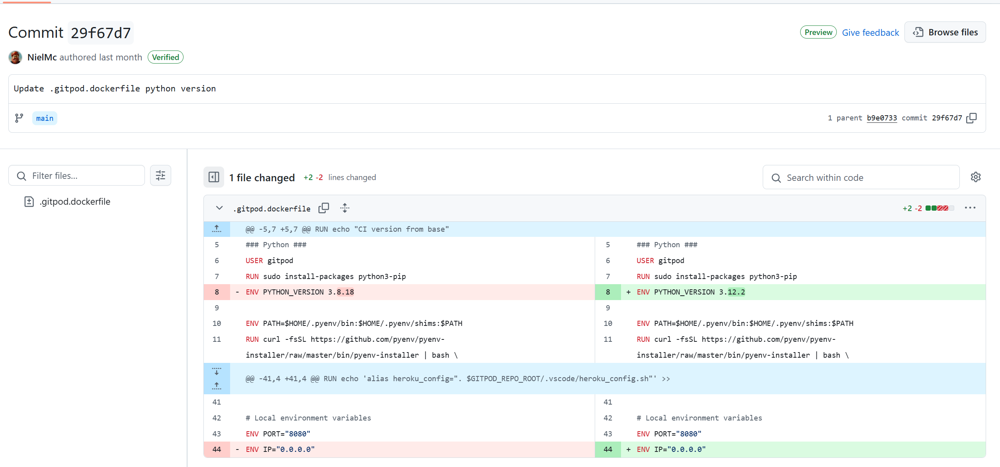

# Mildew Detection in Cherry Leaves

## Table of Contents
1. [Dataset Content](#dataset-content)
2. [Business Requirements](#business-requirements)
3. [Hypothesis and how to validate](#hypothesis-and-how-to-validate)
4. [The rationale to map the business requirements to the Data Visualisations and ML tasks](#the-rationale-to-map-the-business-requirements-to-the-data-visualizations-and-ML-tasks)
5. [ML Business Case](#ml-business-case)
6. [Dashboard design](#dashboard-design)
7. [## Issues](#issues)
8. [Deployment](#deployment)
9. [Technologies Used](#technologies-used)
10. [Credits](#credits)
11. [Acknowledgements](#acknowledgements)

## Cloud IDE Reminders

To log into the Heroku toolbelt CLI:

1. Log in to your Heroku account and go to _Account Settings_ in the menu under your avatar.
2. Scroll down to the _API Key_ and click _Reveal_
3. Copy the key
4. In the terminal, run `heroku_config`
5. Paste in your API key when asked

You can now use the `heroku` CLI program - try running `heroku apps` to confirm it works. This API key is unique and private to you, so do not share it. If you accidentally make it public, then you can create a new one with _Regenerate API Key_.

## Dataset Content

- The dataset is sourced from [Kaggle](https://www.kaggle.com/codeinstitute/cherry-leaves). We then created a fictitious user story where predictive analytics can be applied in a real project in the workplace.
- The dataset contains +4 thousand images taken from the client's crop fields. The images show healthy cherry leaves and cherry leaves that have powdery mildew, a fungal disease that affects many plant species. The cherry plantation crop is one of the finest products in their portfolio, and the company is concerned about supplying the market with a compromised quality product.

## Business Requirements

The cherry plantation crop from Farmy & Foods is facing a challenge where their cherry plantations have been presenting powdery mildew. Currently, the process is manual verification if a given cherry tree contains powdery mildew. An employee spends around 30 minutes in each tree, taking a few samples of tree leaves and verifying visually if the leaf tree is healthy or has powdery mildew. If there is powdery mildew, the employee applies a specific compound to kill the fungus. The time spent applying this compound is 1 minute. The company has thousands of cherry trees located on multiple farms across the country. As a result, this manual process is not scalable due to the time spent in the manual process inspection.

To save time in this process, the IT team suggested an ML system that detects instantly, using a leaf tree image, if it is healthy or has powdery mildew. A similar manual process is in place for other crops for detecting pests, and if this initiative is successful, there is a realistic chance to replicate this project for all other crops. The dataset is a collection of cherry leaf images provided by Farmy & Foods, taken from their crops.

- 1 - The client is interested in conducting a study to visually differentiate a healthy cherry leaf from one with powdery mildew.
- 2 - The client is interested in predicting if a cherry leaf is healthy or contains powdery mildew.

## Hypothesis and how to validate 

**Hypothesis 1**:
 - Cherry leaves which are infected with powdery mildew have a white coating and spots on its sureface. Infected leaves can clearly be distinguished from healthy leaves and validation can be done by comparing healthy and infected leaves based on images.
 - **Validation**: Check visualisation page and compare average image and variability of healthy and infected leaves. Check differences of average healthy and infected leaves. 

**Hypothesis 2**:
 - Average Image, Variability Image and Difference between Averages studies did not reveal any clear pattern to differentiate one from another except some whiteness to the image. An Image Montage shows that mildew infected leaves have white coats on their surface.
 - **Validation**: Check visualisation page and create image montages of 24 healthy and 24 infected leaves and compare the differences. 

**Hypothesis 3**:
 - An ML based model is used in an image visualizer to differentiate between healthy and infected cherry leafs. The model should have a minimum validity of 97% accuracy. By the help of this ML based image visualizer the process should become much more effective for the company in terms of time and money saving.
 - **Validation**: Check mildew detection page and load examplae leaf images of healthy and infected leaves and check the results. 

## The rationale to map the business requirements to the Data Visualizations and ML tasks

**Business Requirement 1**: Data Visualization

We will display the "mean" and "standard deviation" images for healthy and mildew infected leaves.
We will display the difference between average healthy and mildew infected leaves.
We will display an image montage for either healthy or mildew infected leaves. 


**Business Requirement 2**: Classification

We want to predict if a given leaf is infected with powdery mildew or not. 
We want to build a binary classifier and generate reports.

## ML Business Case

 - Objective of the project is to develop a ML 2-class, singel-label classification model, which can predict if a a leaf is infected with powdery mildew or not. The model is based on historical image data.
 - The model should offer cherry plantation farmers a more effective diagnostic method for powdery mildew detection
 - the model success metrics are accuracy of 99% or above on the test set.
 - The model output is defined as a flag, indicating if the leaf or the tree is infected with powdery mildew. The idea is that employees of the plantation will take a picture of some leaves of the tree and evaluate them in the App. The prediction is made on the fly.
 - Currently mildew infection is identified manually in a very time-consuming process so any cherry plantation farm would benefit by using this model 
 - The training data can be downloaded from Kaggle. The original image format is 256x256. As we need to consider a max Slug size of 500 MB on Heroku it is required to reduce the image fomat to 30x30. It is considered that this has no negative impact on model performance. 

## User Stories

### User story: Data Collection and Preparation 

As a data practitioner, I want collect, prepare and clean historical data to use it for data analysis in my ML prediction model.

Acceptance Criteria
a. dataset has to be sufficient enough to create a valid prediction model
b. dataset has to be sufficient enough to create a dataset for Train, Test and Validate
c. dataset need to have a proper format to use in in GitHub and Heroku
d. as I´m using Image based classification model non-image files have to be excluded

### User story: Data visualization

As a data practitioner I want to create diagrams and visualize data and image montages to differentiate a healthy cherry leaf from one with powdery mildew (**Business Requirement 1**).

Acceptance Criteria
a. Difference between average and variability image
b. Differences between average mildew infected leaf and average healthy leaf
c. Image Montage for healthy and infected leaves

### User story: Data Modelling and Evaluation

As a data practitioner want create, train and validate ML model which is suitable to predict if a cherry leaf is healthy or contains powdery mildew (**Business Requirement 2**).

Acceptance Criteria
a. Model training accuracy should be > 97%
b. Model should be optimised according to the requirements and don´t over or under fit
c. Model should be validated against new data

### User story: Dashboard

As a user (cherry tree farmer) I want to have a dashboard app so that I can visually differentiate a healthy cherry leaf from one with powdery mildew and predict if a cherry leaf is healthy or contains powdery mildew.

Acceptance Criteria
a. summary page with brief overview about the project, app, hypothesis and requirements
b. visualization page which helps to differentiate if a cherry leaf is healthy or not (**Business Requirement 1**)
c. a detection page where I can upload leaf images to check if they are infected or not (**Business Requirement 2**)
d. a ML performance page which provides data about the reliability of the used model

## Testing

### User Story Testing:

#### Testing of User story: Data visualization

As a data practitioner I want to create diagrams and visualize data and image montages to differentiate a healthy cherry leaf from one with powdery mildew (**Business Requirement 1**).

Acceptance Criteria
a. Difference between average and variability image 

   Testing steps:
      - Select "Leaves Visualizer" on Dashboard Menu
      - Hit Checkbox "Difference between average and variability image"

   Result:
      - Image diagrams for average and variability images for healthy and infected leaves will be displayed  

b. Differences between average mildew infected leaf and average healthy leaf

   Testing steps:
      - Select "Leaves Visualizer" on Dashboard Menu
      - Hit Checkbox "Differences between average mildew infected leaf and average healthy leaf"
      
   Result:
      - Image diagrams for "Difference between average images" will be displayed  

c. Image Montage for healthy and infected leaves

   Testing steps:
      - Select "Leaves Visualizer" on Dashboard Menu
      - Select "powdery mildew" or "healthy" in selection field on Dashboard Menu
      - Click Button "Create Montage"

   Result:
      - An Image Montage of 24 healthy or 24 powdery mildew infected leaves will be displayed 


#### Testing of User story: Data Modelling and Evaluation

As a data practitioner want create, train and validate ML model which is suitable to predict if a cherry leaf is healthy or contains powdery mildew (**Business Requirement 2**).

Acceptance Criteria
a. Model training accuracy should be > 97%

   Testing steps:
      - Select "ML Performance Metrics" on Dashboard Menu

   Result:
      - Check Accuracy and Loss in Performance of Test Set
      - Check Accuracy in Model History 

b. Model should be optimised according to the requirements and don´t over or under fit

   Testing steps:
      - Select "ML Performance Metrics" on Dashboard Menu

   Result:
      - Check Model Training losses and accuracy in Model History

c. Model should be validated against new data 

      Testing steps:
      - Select "Mildew Detection" on Dashboard Menu
      - Click on Kaggle Download link to download sample data 
      - Click "browse files" and select sample data to validate

   Result:
      - Healthy and infected leaves should be validated correctly 

### Testing of User story: Dashboard

As a user (cherry tree farmer) I want to have a dashboard app so that I can visually differentiate a healthy cherry leaf from one with powdery mildew and predict if a cherry leaf is healthy or contains powdery mildew.

Acceptance Criteria
a. summary page with brief overview about the project, app, hypothesis and requirements

   Testing steps:
      - Select "Quick Project Summary" on Dashboard Menu

   Result:
      - Check general informations (project,requirements etc.) about project
      - Check README.md file under the given link

b. visualization page which helps to differentiate if a cherry leaf is healthy or not (**Business Requirement 1**)

   Testing steps:
      - Select "visualization page" on Dashboard Menu
      - Select any of the three checkboxes 

   Result:
      - Compare the visualization data for differentiating if a cherry leaf is healthy or not

c. a detection page where I can upload leaf images to check if they are infected or not (**Business Requirement 2**)


   Testing steps:
      - Select "Mildew Detection" on Dashboard Menu
      - Download saample data
      - Click browse files button and evaluate sample data

   Result:
      - Sample data should be detected correctly as healthy or infected 

d. a ML performance page which provides data about the reliability of the used model

   Testing steps:
      - Select "ML Performance Metrics" on Dashboard Menu

   Result:
      - Check Frequencies of Train, Validation and Test Set
      - Check Model History
      - Check Performance of Test Set


## Dashboard Design

### Page 1: Quick Project Summary


 - General Information
    - Powdery mildew is a fungal disease on cherry trees. 
    - Infected plants display white powdery coat on the leaves and stems. 
    - The disease occurs mostly in high humid and moderate temperatures. 
    - It can have severe and negative impact on growth, by slowing down the growth of the plant and can infect the fruits as well.
 - Project Dataset
    - The dataset was dowloaded from Kaggle. It contains 2104 healthy leaves and 2104 affected leaves.
 - The project has two business requirements:
    - 1 - The client is interested in conducting a study to visually differentiate a healthy cherry leaf from one with powdery mildew.
    - 2 - The client is interested in predicting if a cherry leaf is healthy or contains powdery mildew.
 - Link to additional information
    - For more information, please visit my GitHub Repo read the README file.

### Page 2: Leaves Visualizer


- It will answer the 1st Requirement: The client is interested in having a study that visually differentiates a parasitised from an healthy leaves.
  - Checkbox 1 - Difference between average and variability image
  - Checkbox 2 - Differences between average mildew infected leaf and average healthy leaf
  - Checkbox 3 - Image Montage for healthy and infected leaves

### Page 3: Powdery Mildew Detection


- 2nd Business Requirement: "The client is interested in predicting if a cherry leaf is healthy or contains powdery mildew."
- Link to download a set of mildew infected and uninfected leaf images for live prediction: "You can download images containing powdery mildew and healthy leaves for prediction [here].(https://www.kaggle.com/datasets/codeinstitute/cherry-leaves/code)."
- User Interface with a file uploader widget. The user should upload multiple cherry leaf images. It will display the image and a prediction statement, indicating if the leaf is infected or not with powdery mildew and the probability associated with this statement.
- Table with the image name and prediction results.
- Download button to download table in a csv file

### Page 4: Project Hypothesis and Validation


Block for each project hypothesis and the conclusion and how this is validated:

Hypothesis 1: Cherry leaves which are infected with powdery mildew have a white coating and spots on its sureface. Infected leaves can clearly be distinguished from healthy leaves.
Validation: Check visualisation page and compare average image and variability of healthy and infected leaves. Check differences of average healthy and infected leaves.
Average Image, Variability Image and difference of average healthy and infected leaves did not reveal any clear pattern to differentiate one from another except some whiteness to the image.

Hypothesis 2: An Image Montage shows that mildew infected leaves have white coats on their surface.
Validation: Check visualisation page and create image montages of 24 healthy and 24 infected leaves and compare the differences.
Comparing 24 healthy and infected leaves from the Montage differences are intuitively visible.

Hypothesis 3: An ML based model is used in an image visualizer to differentiate between healthy and infected cherry leafs. The model should have a minimum validity of 97% accuracy. By the help of this ML based image visualizer the process should become much more effective for the company in terms of time and money saving.
Validation: Check mildew detection page and load example leaf images of healthy and infected leaves and check the results.
The model is validated with > 97% accuracy. All tested example images were predicted correctly.

### Page 5: ML Performance Metrics

- Label Frequencies for Train, Validation and Test Sets


- Model History: Accuracy and Losses
- Model evaluation result


## Issues

I hade a big issue during deployment, which was caused by compatibility conflicts. The old template provided by Code institute was build for Python version 3.8.18 and its compatible packages:

Python Version Compatibility
Package	Compatible      Python Versions
numpy==1.19.2	        Python 3.6 - 3.8
pandas==1.1.2	        Python 3.6 - 3.8
matplotlib==3.3.1	    Python 3.6 - 3.8
seaborn==0.11.0	        Python 3.6 - 3.8
plotly==4.12.0	        Python 3.6 - 3.8
streamlit==0.85.0	    Python 3.7 - 3.9
scikit-learn==0.24.2	Python 3.6 - 3.9
tensorflow-cpu==2.6.0	Python 3.6 - 3.9
keras==2.6.0	        Python 3.6 - 3.9
protobuf==3.20	        Python 3.6 - 3.10
altair<5	            Python 3.6 - 3.10

This build could be deployed on Heroku-20. By using above parameter and excluding input dataset in slugignore and reducing image down to 50x50 it was almost possible to stay below the max. slugsize of 500MB. 

Since few days python 3.8.18 is not supported anymore:


The Python version and the dependencies for the Code Institute template were changed last month:





The dependencies, especially tensorflow-cpu==2.16.1 is much bigger now. Hence it was very difficult to stay in the given slugsize of 500MB.
For this reason I reduced the image shape size down to 30x30. The Model is still valid. On my local machine I used 256x256. I reduced it only because of this limitation down to 30x30. In a real life scenario I would prefer to use an infrastructure which has not such limitation. It took me several days effort to deal with this issue. 


## Deployment

### Heroku

- The App live link is: `https://pp5milddetect-6c1639863d14.herokuapp.com/`
- Ensure in the setup.sh file containing the following:
```
mkdir -p ~/.streamlit/
echo "\
[server]\n\
headless = true\n\
port = $PORT\n\
enableCORS = false\n\
\n\
" > ~/.streamlit/config.toml
```

- Set the runtime.txt Python version to a [Heroku-20](https://devcenter.heroku.com/articles/python-support#supported-runtimes) stack currently supported version.

- Create a Procfile file and add the following:
```
web: sh setup.sh && streamlit run app.py
```

- The project was deployed to Heroku using the following steps.

1. Log in to Heroku and create an App
2. At the Deploy tab, select GitHub as the deployment method.
3. Select your repository name and click Search. Once it is found, click Connect.
4. Select the branch you want to deploy, then click Deploy Branch.
5. The deployment process should happen smoothly if all deployment files are fully functional. Click the button Open App on the top of the page to access your App.
6. If the slug size is too large, then add large files not required for the app to the .slugignore file. (e.g.: input data; assets, readme, cache etc.) 

## Technologies Used

### Languages: 

[Python](https://www.python.org/)

### Main Data Analysis and Machine Learning Libraries

 **NumPy**: A library for numerical computations in Python, providing support for multi-dimensional arrays, mathematical functions, linear algebra, and random number generation.

 **Pandas**: A library for data manipulation and analysis, offering DataFrame objects for structured data handling, along with tools for cleaning, transforming, and analyzing data efficiently.

 **Matplotlib**: A library for creating static, animated, and interactive visualizations in Python, offering fine-grained control over plots and charts.

 **Seaborn**: A statistical data visualization library built on top of Matplotlib, designed to create aesthetically pleasing and informative graphics with simplified syntax for complex plots.

 **Plotly**: An interactive graphing library that supports a wide range of plots (e.g., scatter, bar, heatmaps).

 **Streamlit**: A Python library for building fast, interactive, and intuitive web apps, specifically geared toward showcasing machine learning models and data visualizations with minimal coding effort.

 **Scikit-learn**: A machine learning library that provides simple and efficient tools for data mining and analysis, including classification, regression, clustering, and dimensionality reduction algorithms.

 **TensorFlow (CPU version)**: A library for building and deploying machine learning models, particularly deep learning, with tools for training neural networks on CPUs.

 **Keras**: A deep learning API running on top of TensorFlow, designed to enable fast prototyping, minimal code, and seamless implementation of neural networks.

### Other Technologies

* [GitHub](https://github.com/) - Code repository and GitHub projects was used as a Kanban board for Agile development
* [Heroku](https://heroku.com) - For application deployment
* [Gitpod](https://gitpod.io/) - IDE for development


## Credits

[Code Institute Walkthrough Project 01] https://github.com/Code-Institute-Solutions/WalkthroughProject01: Code, basic structure, logic and design 
[Code Institute Project Idea: Mildew Detection in Cherry Leaves] https://github.com/Code-Institute-Solutions/milestone-project-mildew-detection-in-cherry-leaves: Template


### Content

- https://learn.codeinstitute.net/courses/course-v1:code_institute+CI_DA_ML+2021_Q4/courseware/07a3964f7a72407ea3e073542a2955bd/29ae4b4c67ed45a8a97bb9f4dcfa714b/: Lectures and Videos

- https://learn.codeinstitute.net/courses/course-v1:CodeInstitute+PA_PAGPPF+2/courseware/bde016cdbd184cdeafd341a73807e138/bd2104eb84de4e48a9df6f685773cbf2/: Background for the Requirements

- https://en.wikipedia.org/wiki/Powdery_mildew#:~:text=Powdery%20mildew%20is%20a%20fungal,causal%20pathogen%20are%20quite%20distinctive: Context information abput Mildew infection 


## Acknowledgements

Thanks to my mentor Mo Shami for his advise during the work on my project. Special thanks to Kristyna for all your support, kindness, availability and positive attitude!
